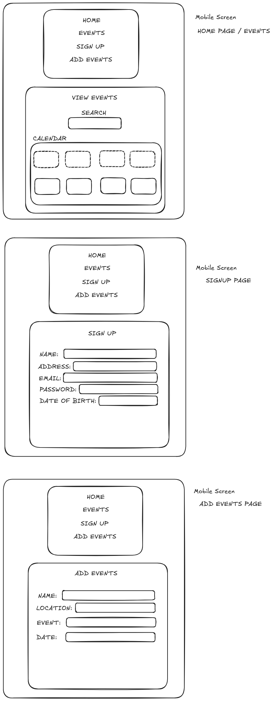

<h1>Event Platform.</h1>

() npm create vite@latest events-platform -- --template react   

() npm init playwright   

() npm install firebase   

() npm install -g firebase-tools   

() npm firebase deploy   

() npm install firebase react-router-dom   

() I created the Project Structure as followed:    

src/
├── Components/
│   ├── EventCard.jsx
│   ├── EventForm.jsx
│   └── ProtectedRoute.jsx
├── pages/
│   ├── Home.jsx
│   ├── Login.jsx
│   ├── Dashboard.jsx
│   └── CreateEvent.jsx
├── services/
│   ├── firebase.js
│   └── calendar.js
├── App.jsx
└── main.jsx

() On the Google Calendar website >> Create project > Enable Google Calendar API >> OAuth consent screen > Add scope >> https://www.googleapis.com/auth/calendar.events >> Create OAuth Client ID → Web App >> http://localhost:5173   

() I added the script tag to the following path public/index.html   

() Added the Google Calendar API information to services/calendar.js  

()  